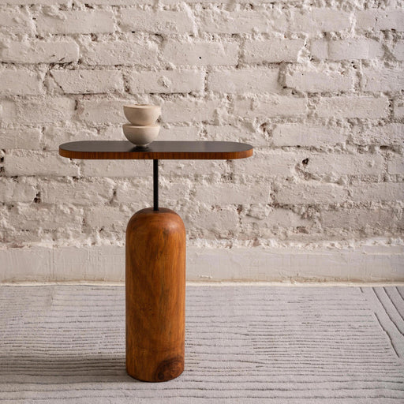

## About the repo
This repository showcases a ComfyUI workflow that can take any image as input and generate a lifestyle background around it using models built upon the Stable Diffusion 1.5 architecture. This workflow can also be triggered via API requests.

##Soon
This workflow will soon incorporate the ability to render a background for the product from any given angle while keeping it consistent and include dynamic background capabilities.  

## Workflow
Here is an overview of the workflow:

### Sample Output
Below are sample output images:

  
  

